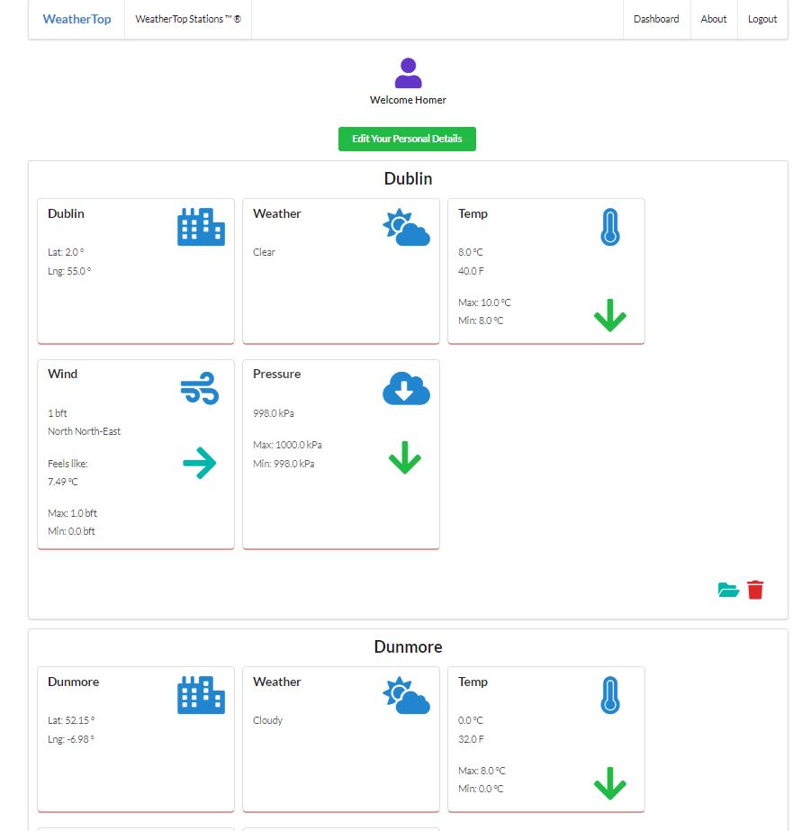
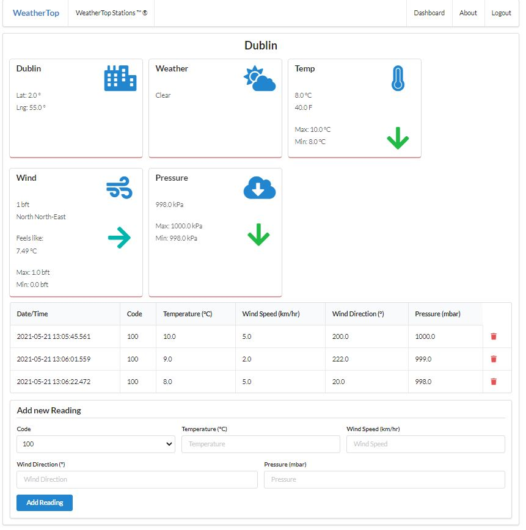

# Weather-top web application

**This is a web application that allows users to add weather readings of different locations using a cloud database and Play framework.** 
  
  - Accessible at https://still-ridge-30616.herokuapp.com/
 
## Visual  
- A summary display of weather reading and any trends in the weather readings are automatically generated.
  

  
  
- CRUD features for the weather readings.
  

